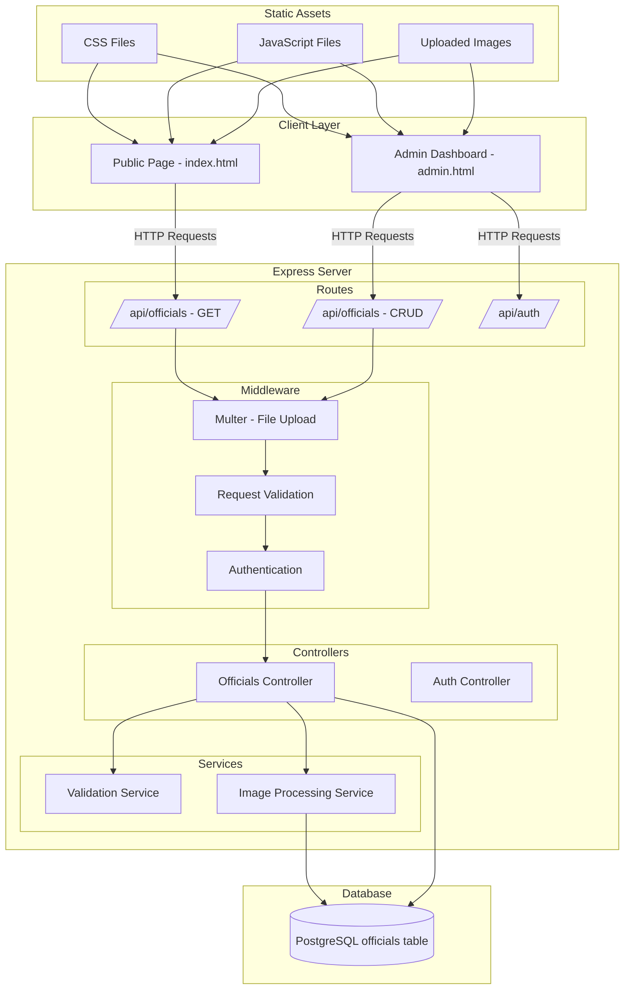

# Church Officials Management System - Architecture Document

## Table of Contents
1. [Project Overview](#project-overview)
2. [Folder Structure](#folder-structure)
3. [Database Schema](#database-schema)
4. [API Endpoint Specifications](#api-endpoint-specifications)
5. [Category Validation Logic](#category-validation-logic)
6. [File Naming Conventions](#file-naming-conventions)
7. [Technology Stack](#technology-stack)
8. [System Architecture Diagram](#system-architecture-diagram)
9. [Frontend Design Specifications](#frontend-design-specifications)

---

## 1. Project Overview

### Purpose
Build a full-stack web application for managing church officials with role-based category limits and image management capabilities.

### Architecture Style
- **Backend**: REST API with Node.js and Express
- **Database**: PostgreSQL with Prisma ORM
- **Frontend**: Vanilla HTML, CSS, JavaScript
- **File Handling**: Multer for image uploads

---

## 2. Folder Structure

```
weekend2/
├── 📁 docs/                      # Documentation
│   └── architecture.md           # This file
├── 📁 src/                       # Source code
│   ├── 📁 config/                # Configuration files
│   │   ├── database.js           # Database connection
│   │   └── upload.js             # Multer configuration
│   ├── 📁 controllers/            # Request handlers
│   │   ├── officialsController.js
│   │   └── validationController.js
│   ├── 📁 middleware/            # Custom middleware
│   │   ├── auth.js              # Authentication middleware
│   │   ├── validation.js        # Category validation
│   │   └── upload.js            # File upload middleware
│   ├── 📁 models/                # Data models
│   │   ├── Official.js          # Official model
│   │   └── database.js          # Database setup
│   ├── 📁 routes/                # API routes
│   │   ├── officialsRoutes.js
│   │   └── adminRoutes.js
│   ├── 📁 services/              # Business logic
│   │   ├── officialService.js
│   │   └── imageService.js
│   └── 📁 utils/                 # Utility functions
│       ├── helpers.js
│       └── validators.js
├── 📁 uploads/                   # Uploaded files (static)
│   ├── 📁 officials/            # Official photos
│   │   ├── thumb/               # Thumbnail versions
│   │   └── original/            # Original files
│   └── 📁 temp/                 # Temporary uploads
├── 📁 public/                    # Frontend files
│   ├── 📁 css/
│   │   ├── main.css
│   │   ├── public.css
│   │   └── admin.css
│   ├── 📁 js/
│   │   ├── main.js
│   │   ├── public.js
│   │   └── admin.js
│   ├── 📁 images/
│   │   ├── icons/
│   │   └── branding/
│   ├── index.html               # Public page
│   ├── admin.html               # Admin dashboard
│   └── login.html               # Admin login
├── 📁 .env                      # Environment variables
├── 📁 .gitignore
├── package.json
├── server.js                    # Application entry point
└── README.md
```

---

## 3. Database Schema

### Table: `officials`

```sql
CREATE TABLE officials (
    id SERIAL PRIMARY KEY,
    name VARCHAR(255) NOT NULL,
    category VARCHAR(50) NOT NULL,
    photo_url TEXT,
    created_at TIMESTAMP DEFAULT CURRENT_TIMESTAMP,
    updated_at TIMESTAMP DEFAULT CURRENT_TIMESTAMP
);

-- Indexes for performance
CREATE INDEX idx_officials_category ON officials(category);
CREATE INDEX idx_officials_created_at ON officials(created_at DESC);
```

### Category Constraints Reference

| Category    | Max Limit |
|-------------|-----------|
| Executive   | 7         |
| Jumuia      | 2         |
| Bible       | 2         |
| Rosary      | 2         |
| Liturgist   | 2         |
| Choir       | 2         |
| Catechist   | 1         |

### Database Configuration (`.env`)

```env
# Database Configuration
DB_HOST=localhost
DB_PORT=5432
DB_NAME=church_officials
DB_USER=postgres
DB_PASSWORD=your_password

# Server Configuration
PORT=3000
NODE_ENV=development

# Upload Configuration
MAX_FILE_SIZE=5242880
UPLOAD_PATH=./uploads/officials

# JWT Secret (for admin authentication)
JWT_SECRET=your-super-secret-key
```

---

## 4. API Endpoint Specifications

### Base URL: `/api`

#### 4.1 GET /officials
Retrieve all officials, optionally grouped by category.

**Request:**
```http
GET /api/officials
GET /api/officials?grouped=true
```

**Response:**
```json
{
  "success": true,
  "data": {
    "Executive": [
      {
        "id": 1,
        "name": "Rev. John Smith",
        "category": "Executive",
        "photo_url": "/uploads/officials/photo_1.jpg",
        "created_at": "2024-01-15T10:30:00Z"
      }
    ],
    "Jumuia": [...],
    "Bible": [...]
  }
}
```

---

#### 4.2 POST /officials
Add a new official with image upload.

**Request:**
```http
POST /api/officials
Content-Type: multipart/form-data

Body:
- name: string (required)
- category: string (required)
- photo: file (optional, max 5MB)
```

**Validation Rules:**
- `name`: Required, 2-255 characters
- `category`: Required, must be valid category
- `photo`: Optional, allowed types: jpg, jpeg, png, gif; max 5MB

**Response (Success):**
```json
{
  "success": true,
  "message": "Official added successfully",
  "data": {
    "id": 2,
    "name": "Mary Adams",
    "category": "Jumuia",
    "photo_url": "/uploads/officials/photo_2.jpg",
    "created_at": "2024-01-15T11:00:00Z"
  }
}
```

**Response (Error - Category Full):**
```json
{
  "success": false,
  "error": "Category limit reached",
  "message": "The 'Jumuia' category has reached its maximum limit of 2 officials"
}
```

---

#### 4.3 PUT /officials/:id
Update an official's information and/or photo.

**Request:**
```http
PUT /api/officials/:id
Content-Type: multipart/form-data

Body:
- name: string (optional)
- category: string (optional)
- photo: file (optional)
```

**Response (Success):**
```json
{
  "success": true,
  "message": "Official updated successfully",
  "data": {
    "id": 2,
    "name": "Mary Adams",
    "category": "Bible",
    "photo_url": "/uploads/officials/photo_2.jpg",
    "updated_at": "2024-01-15T12:00:00Z"
  }
}
```

---

#### 4.4 DELETE /officials/:id
Delete an official and their associated photo.

**Request:**
```http
DELETE /api/officials/:id
```

**Response (Success):**
```json
{
  "success": true,
  "message": "Official deleted successfully"
}
```

**Response (Error - Not Found):**
```json
{
  "success": false,
  "error": "Official not found",
  "message": "No official found with ID: 5"
}
```

---

## 5. Category Validation Logic

### Validation Service Specification

#### Category Limits Object
```javascript
const CATEGORY_LIMITS = {
    'Executive': 6,
    'Jumuia': 2,
    'Bible': 2,
    'Rosary': 2,
    'Pamphlet': 2,
    'Project': 2,
    'Liturgist': 2,
    'Choir': 2,
    'Catechist': 1
};
```

#### Validation Flow

```
┌─────────────────────────────────────────────────────────────┐
│                    POST /officials                          │
├─────────────────────────────────────────────────────────────┤
│  Step 1: Validate input (name, category)                     │
│  Step 2: Check if category is valid                          │
│  Step 3: Count current officials in category                 │
│  Step 4: Compare with limit                                  │
│  Step 5: If count >= limit → REJECT with error               │
│  Step 6: If count < limit → PROCEED with creation            │
└─────────────────────────────────────────────────────────────┘
```

#### Validation Functions

```javascript
// services/validationService.js

const CATEGORY_LIMITS = {
    'Executive': 6,
    'Jumuia': 2,
    'Bible': 2,
    'Rosary': 2,
    'Pamphlet': 2,
    'Project': 2,
    'Liturgist': 2,
    'Choir': 2,
    'Catechist': 1
};

class ValidationService {
    
    /**
     * Validate category exists
     */
    static isValidCategory(category) {
        return Object.keys(CATEGORY_LIMITS).includes(category);
    }
    
    /**
     * Get category limit
     */
    static getCategoryLimit(category) {
        return CATEGORY_LIMITS[category] || 0;
    }
    
    /**
     * Check if category has reached limit
     * @param {Object} db - Database connection
     * @param {string} category - Category to check
     * @param {number} excludeId - ID to exclude (for updates)
     * @returns {Promise<{reached: boolean, current: number, limit: number}>}
     */
    static async checkCategoryLimit(db, category, excludeId = null) {
        const limit = this.getCategoryLimit(category);
        
        const query = `
            SELECT COUNT(*) as count 
            FROM officials 
            WHERE category = $1
            ${excludeId ? 'AND id != $2' : ''}
        `;
        
        const params = excludeId ? [category, excludeId] : [category];
        const result = await db.query(query, params);
        
        const current = parseInt(result.rows[0].count);
        
        return {
            reached: current >= limit,
            current: current,
            limit: limit,
            available: limit - current
        };
    }
    
    /**
     * Validate official creation
     */
    static async validateCreate(db, data) {
        const errors = [];
        
        // Validate name
        if (!data.name || data.name.trim().length < 2) {
            errors.push('Name must be at least 2 characters');
        }
        
        // Validate category
        if (!this.isValidCategory(data.category)) {
            errors.push(`Invalid category. Valid categories: ${Object.keys(CATEGORY_LIMITS).join(', ')}`);
        } else {
            // Check category limit
            const limitCheck = await this.checkCategoryLimit(db, data.category);
            if (limitCheck.reached) {
                errors.push(`Category '${data.category}' has reached its limit of ${limitCheck.limit} officials`);
            }
        }
        
        return {
            valid: errors.length === 0,
            errors: errors
        };
    }
    
    /**
     * Validate official update
     */
    static async validateUpdate(db, id, data) {
        const errors = [];
        
        // Check if official exists
        const official = await db.query('SELECT * FROM officials WHERE id = $1', [id]);
        if (official.rows.length === 0) {
            errors.push('Official not found');
            return { valid: false, errors };
        }
        
        const current = official.rows[0];
        
        // Validate name if provided
        if (data.name && data.name.trim().length < 2) {
            errors.push('Name must be at least 2 characters');
        }
        
        // Validate category if provided
        if (data.category && data.category !== current.category) {
            if (!this.isValidCategory(data.category)) {
                errors.push(`Invalid category. Valid categories: ${Object.keys(CATEGORY_LIMITS).join(', ')}`);
            } else {
                // Check limit for new category (excluding current official)
                const limitCheck = await this.checkCategoryLimit(db, data.category, id);
                if (limitCheck.reached) {
                    errors.push(`Category '${data.category}' has reached its limit of ${limitCheck.limit} officials`);
                }
            }
        }
        
        return {
            valid: errors.length === 0,
            errors: errors
        };
    }
}

module.exports = { ValidationService, CATEGORY_LIMITS };
```

---

## 6. File Naming Conventions

### Uploaded Files

```
Pattern: officials_{category}_{timestamp}_{random}.{ext}
Example: officials_executive_20240115_123456_abc123.jpg
```

### Frontend Files

| File               | Purpose                              |
|--------------------|--------------------------------------|
| `main.css`         | Shared styles and variables          |
| `public.css`       | Public page specific styles          |
| `admin.css`        | Admin dashboard specific styles      |
| `public.js`        | Public page functionality            |
| `admin.js`         | Admin dashboard functionality        |
| `index.html`       | Public officials display page        |
| `admin.html`       | Admin CRUD dashboard                 |
| `login.html`       | Admin authentication page           |

### Backend Files

| File                  | Purpose                            |
|-----------------------|-----------------------------------|
| `officialsRoutes.js`  | REST API routes                   |
| `officialsController.js` | Request handlers                |
| `officialService.js`  | Business logic layer             |
| `validationService.js`| Category validation logic        |
| `database.js`         | Database connection and setup    |
| `upload.js`           | Multer configuration             |
| `auth.js`             | Authentication middleware        |

---

## 7. Technology Stack

### Backend Dependencies (`package.json`)

```json
{
  "dependencies": {
    "express": "^4.18.2",
    "pg": "^8.11.3",
    "multer": "^1.4.5-lts.1",
    "dotenv": "^16.3.1",
    "cors": "^2.8.5",
    "helmet": "^7.1.0",
    "express-validator": "^7.0.1",
    "jsonwebtoken": "^9.0.2",
    "bcryptjs": "^2.4.3",
    "sharp": "^0.33.1"
  },
  "devDependencies": {
    "nodemon": "^3.0.2"
  }
}
```

### Key Libraries

| Library       | Purpose                          |
|---------------|----------------------------------|
| `express`     | Web framework                    |
| `pg`          | PostgreSQL driver                |
| `multer`      | File upload handling             |
| `sharp`       | Image processing (resize, optimize)|
| `dotenv`      | Environment variables            |
| `cors`        | Cross-origin resource sharing    |
| `helmet`      | Security headers                 |
| `express-validator` | Request validation        |
| `jsonwebtoken`| JWT authentication              |
| `bcryptjs`    | Password hashing                 |

---

## 8. System Architecture Diagram



---

## 9. Frontend Design Specifications

### 9.1 Public Page (`index.html`)

#### Layout Structure
```
┌─────────────────────────────────────────┐
│  Header: Church Name + Logo             │
├─────────────────────────────────────────┤
│  Title: Parish Officials                │
├─────────────────────────────────────────┤
│  ┌─────────┐ ┌─────────┐ ┌─────────┐    │
│  │Executive│ │ Jumuia  │ │  Bible  │    │
│  │ Section │ │ Section │ │ Section │    │
│  ├─────────┤ ├─────────┤ ├─────────┤    │
│  │  Grid   │ │  Grid   │ │  Grid   │    │
│  │  Cards  │ │  Cards  │ │  Cards  │    │
│  └─────────┘ └─────────┘ └─────────┘    │
├─────────────────────────────────────────┤
│  ┌─────────┐ ┌─────────┐ ┌─────────┐    │
│  │ Rosary  │ │Liturgist│ │  Choir  │    │
│  │ Section │ │ Section │ │ Section │    │
│  ├─────────┤ ├─────────┤ ├─────────┤    │
│  │  Grid   │ │  Grid   │ │  Grid   │    │
│  │  Cards  │ │  Cards  │ │  Cards  │    │
│  └─────────┘ └─────────┘ └─────────┘    │
├─────────────────────────────────────────┤
│  ┌─────────┐                           │
│  │Catechist│                           │
│  │ Section │                           │
│  ├─────────┤                           │
│  │  Card   │                           │
│  └─────────┘                           │
├─────────────────────────────────────────┤
│  Footer: Contact Info                   │
└─────────────────────────────────────────┘
```

#### Design Theme
- **Style**: Church/Ministry aesthetic
- **Colors**: 
  - Primary: Deep blue (#1a365d)
  - Secondary: Gold (#d69e2e)
  - Background: Off-white (#f7fafc)
- **Typography**: Serif for headings, Sans-serif for body
- **Card Design**:
  - White background with subtle shadow
  - Photo on top (circle or rounded rectangle)
  - Name below in bold
  - Category badge

#### Responsive Breakpoints
- Desktop: 4 cards per row
- Tablet: 2 cards per row
- Mobile: 1 card per row

---

### 9.2 Admin Dashboard (`admin.html`)

#### Layout Structure
```
┌─────────────────────────────────────────┐
│  Sidebar Navigation                      │
│  ┌─────────────────────────────────┐    │
│  │ Dashboard                       │    │
│  │ Officials List                  │    │
│  │ Add Official                    │    │
│  │ Logout                          │    │
│  └─────────────────────────────────┘    │
├─────────────────────────────────────────┤
│  Main Content Area                       │
│  ┌─────────────────────────────────┐    │
│  │ Page Title + Add Button         │    │
│  ├─────────────────────────────────┤    │
│  │ Stats Cards (Total, By Category)│    │
│  ├─────────────────────────────────┤    │
│  │ Officials Table                 │    │
│  │ ┌───┬──────┬─────────┬──────┬───┐│    │
│  │ │ID │ Name │Category │Photo │Act││    │
│  │ ├───┼──────┼─────────┼──────┼───┤│    │
│  │ │ 1 │ John │Executive│ img  │✏️🗑️││    │
│  │ │ 2 │ Mary │ Jumuia │ img  │✏️🗑️││    │
│  │ └───┴──────┴─────────┴──────┴───┘│    │
│  └─────────────────────────────────┘    │
└─────────────────────────────────────────┘
```

#### Admin Features
- **Dashboard Statistics**: Total officials, count per category
- **Add Official Modal**: Form with name, category dropdown, image upload
- **Edit Official Modal**: Pre-filled form with update capability
- **Delete Confirmation**: Warning before deletion
- **Category Indicator**: Visual feedback when category is full
- **Search/Filter**: Search by name, filter by category

#### Admin Design Theme
- **Style**: Clean, professional dashboard
- **Colors**:
  - Primary: Slate blue (#475569)
  - Accent: Emerald green (#10b981)
  - Danger: Red (#ef4444)
  - Warning: Amber (#f59e0b)
- **Table Design**:
  - Striped rows
  - Hover effects
  - Action buttons with icons
- **Modal Design**:
  - Centered overlay
  - Form validation feedback
  - Progress indicator for uploads

---

## 10. Implementation Priority

### Phase 1: Core Foundation
1. [ ] Set up project structure and dependencies
2. [ ] Configure PostgreSQL database
3. [ ] Create Express server with basic routes
4. [ ] Implement officials table schema

### Phase 2: CRUD Operations
1. [ ] Implement GET /api/officials endpoint
2. [ ] Implement POST /api/officials endpoint
3. [ ] Implement PUT /api/officials/:id endpoint
4. [ ] Implement DELETE /api/officials/:id endpoint
5. [ ] Add Multer for image uploads

### Phase 3: Validation & Business Logic
1. [ ] Implement category validation service
2. [ ] Add category limit enforcement
3. [ ] Create image processing service (Sharp)
4. [ ] Add authentication middleware

### Phase 4: Frontend Development
1. [ ] Create public page (index.html)
2. [ ] Create admin dashboard (admin.html)
3. [ ] Implement public CSS styles
4. [ ] Implement admin CSS styles
5. [ ] Connect frontend to API

### Phase 5: Polish & Deploy
1. [ ] Add error handling and user feedback
2. [ ] Implement responsive design
3. [ ] Add loading states and animations
4. [ ] Set up environment configuration
5. [ ] Test and fix bugs

---

## 11. Error Handling Strategy

### API Error Codes

| Code  | Meaning                  | Scenario                           |
|-------|--------------------------|-----------------------------------|
| 200   | OK                       | Successful request                |
| 201   | Created                  | Resource created successfully     |
| 400   | Bad Request              | Invalid input data                 |
| 401   | Unauthorized             | Missing/invalid JWT token          |
| 403   | Forbidden                | Insufficient permissions           |
| 404   | Not Found                | Resource doesn't exist             |
| 409   | Conflict                 | Category limit reached             |
| 413   | Payload Too Large        | File too large                     |
| 422   | Unprocessable Entity     | Validation failed                  |
| 500   | Internal Server Error    | Unexpected error                   |

### Error Response Format

```json
{
  "success": false,
  "error": "Error Type",
  "message": "Human-readable error message",
  "details": {
    "field": "category",
    "issue": "Category limit reached"
  }
}
```

---

## 12. Security Considerations

1. **Input Validation**: Sanitize all user inputs
2. **File Upload Restrictions**:
   - Allowed types: jpg, jpeg, png, gif
   - Max size: 5MB
   - Rename files to prevent overwrites
3. **Authentication**: JWT-based auth for admin routes
4. **Rate Limiting**: Implement request rate limits
5. **CORS**: Configure allowed origins
6. **Helmet**: Use security headers

---

## 13. Testing Strategy

### Unit Tests
- Validation service functions
- Controller logic
- Utility functions

### Integration Tests
- API endpoint testing
- Database operations
- File upload handling

### Manual Testing
- Admin dashboard CRUD operations
- Category limit enforcement
- Responsive design across devices

---

## 14. Deployment Considerations

### Development
- Local PostgreSQL instance
- Nodemon for auto-restart
- Environment variables in `.env`

### Production
- Cloud database (e.g., Supabase, Railway)
- Static file serving via Express
- Process manager (PM2)
- SSL/TLS certificates

---

## 15. Summary

This architecture document provides a comprehensive blueprint for building a church officials management system with:

- **RESTful API** with full CRUD operations
- **PostgreSQL database** with category-based constraints
- **Image upload** handling with Multer
- **Two frontend pages**: Public display and Admin dashboard
- **Category validation** with configurable limits
- **Professional folder structure** for maintainability

All components are designed to work together seamlessly while maintaining clean separation of concerns and extensibility for future enhancements.
